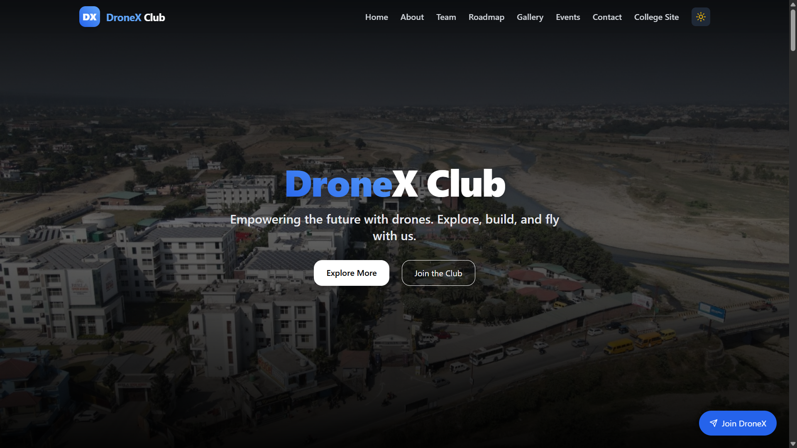
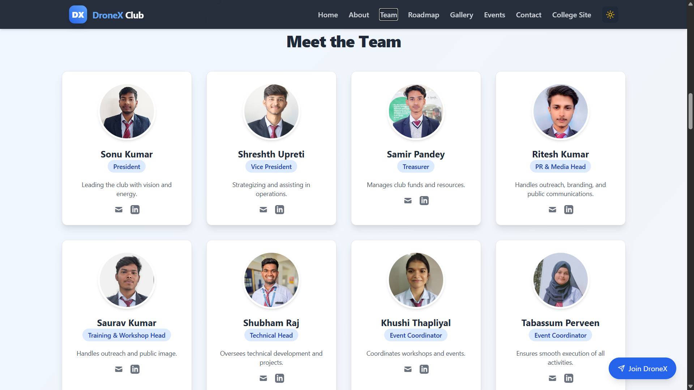

# 🚁 DroneX – Drone Research & Innovation

DroneX is the official **Drone Club of Shivalik College of Engineering**, dedicated to research, design, and innovation in aerial and hybrid drones.  
This project is the club’s website and open-source hub for showcasing our work, sharing knowledge, and collaborating on drone technology.  ## 🙏 Acknowledgements

We would like to thank the following for their support and inspiration:

- **Shivalik College of Engineering** – for providing resources and guidance
- **Dr. Abhishek Jha (Mech Dept)** – Club Co-ordinator  
- **Er. Ashish Kumar Gupta (Electronics Dept.)** – for mentoring our drone research journey  
- **Open Source Community** – for the amazing tools and frameworks we use (React, Tailwind, Vite, etc.)  
- **Our Core Team & Members** – for their hard work and dedication to DroneX  
## 📎 Appendix

Here are some additional resources related to DroneX:

- 📘 [Project Documentation](./docs) – Detailed notes on design, architecture, and workflow  
- 🎥 [Demo Video] – Walkthrough of the DroneX website & drone prototypes  
- 🛠 [Contributing Guide] – Steps to contribute to this project  
- 📄 [License](./LICENSE) – Project license details  
- 🌐 [Official Instagram](https://instagram.com/droneclubshivalik) – Follow our journey  
## 👨‍💻 Authors

This project is developed and maintained by the **DroneX Core Team** at Shivalik College of Engineering:

- [**Samir Pandey**](https://github.com/samirpandey-07) – Treasurer & Full-Stack Developer  
- **Sonu Kumar** – President  
- **Shreshth Upreti** – Vice President  
- **Saurav Kumar** – PR & Media Head  
- **Shubham Kumar** – Technical Head  
- **Tabassum Latif** – Event Coordinator  
- **Khushi Thapliyal** – Event Coordinator  
## 🏷️ Badges


## 🎨 Color Reference

| Color             | Hex                                                                |
| ----------------- | ------------------------------------------------------------------ |
| Primary Blue      |  `#1E3A8A` |
| Accent Cyan       |  `#06B6D4` |
| Jet Black         |  `#111111` |
| Pure White        |  `#FFFFFF` |
| Neutral Gray      |  `#6B7280` |
## 🤝 Contributing

Contributions are always welcome!  

If you’d like to improve DroneX, follow these steps:

1. **Fork** the repository  
2. Create a new branch  
   ```bash
   git checkout -b feature/your-feature-name
## 🎥 Demo

🔗 **Live Website:** [https://dronexse.in](https://dronexse.in)  

📸 **Screenshots:**

  
*DroneX homepage showcasing the club’s vision and latest projects*

  
*Meet the DroneX core team and mentors*

  
*Ongoing drone prototypes and research work*
## 🚀 Deployment

The DroneX website is live at: [https://dronexse.in](https://dronexse.in)  

### Hosting & Domain Setup
- The website is **hosted on Netlify** for fast and reliable deployment  
- The custom domain **dronexse.in** is managed through **GoDaddy DNS** and connected to Netlify  

### Deployment Steps
1. Push your latest code changes to GitHub  
2. Netlify automatically builds and deploys the project  
   - **Build command:**  
     ```bash
     npm run build
     ```
   - **Publish directory:**  
     ```
     dist
     ```
3. Domain management:  
   - Log in to GoDaddy → Manage DNS for `dronexse.in`  
   - Point your domain’s **CNAME record** to Netlify (`your-site.netlify.app`)  
   - Add any required **TXT / verification records** if prompted by Netlify  

### Alternative Deployment
If needed, the project can also be hosted on **Vercel** or any other static hosting service.
## ❓ FAQ

#### Question 1  
What is DroneX?  

**Answer 1**  
DroneX is a student-led drone club project at **Shivalik College of Engineering**, focused on building drones, exploring aerial-aquatic hybrid UAVs, and promoting innovation.  

#### Question 2  
How is the DroneX website deployed?  

**Answer 2**  
The site is hosted on **Netlify** and connected to our custom domain via **GoDaddy** → [dronexse.in](https://dronexse.in).  
## ✨ Features

- 🚀 **Modern UI/UX** – Clean, responsive, and user-friendly design.  
- 🛰️ **Drone Projects Showcase** – Highlighting innovative drone builds, including aerial-aquatic hybrids.  
- 📸 **Team & Mentors Page** – Dedicated section to recognize our core team and faculty mentors.  
- 🌐 **Custom Domain** – Hosted at [dronexse.in](https://dronexse.in) with secure and fast deployment.  
- 📱 **Responsive Design** – Works seamlessly on desktop, tablet, and mobile devices.  
- ⚡ **Fast Deployment** – Powered by **Netlify** with CI/CD integration for instant updates.  
- 📂 **Open Source** – Freely available for contributions, learning, and collaboration.  
- 🔒 **Secure Setup** – Uses environment variables to protect API keys and sensitive data.  
- 🛠️ **Easy Setup** – Simple installation process to run the project locally.  
## 🚀 About Me

Hi 👋, I’m **Samir Pandey**, a passionate **Full-Stack Developer** and **Drone Enthusiast**.  
Currently, I’m pursuing **B.Tech in Computer Science Engineering** at *Shivalik College of Engineering*.  

💡 I founded **DroneX**, a community-driven drone club, to explore innovations in **aerial and aquatic drone technology**.  
Apart from coding and building drones, I’m also interested in **cybersecurity, AI, and open-source projects**.  

- 🌱 Currently learning **DSA, Web Development & Ethical Hacking**  
- 🛠️ Building an **Aerial–Aquatic Hybrid Drone** project  
- 📫 Reach me at **pamdeysamir@gmail.com**  
- ⚡ Fun fact: I can manage both **event coordination** and **coding marathons** without sleep 😅  
## 📝 Feedback

If you have any feedback, suggestions, or ideas to improve DroneX, please feel free to reach out:  

- 📧 Email: pamdeysamir@gmail.com  
- 🌐 Website: [dronexse.in](https://dronexse.in)  
- 💬 Open an issue on our [GitHub Repository](https://github.com/your-repo-link)  
